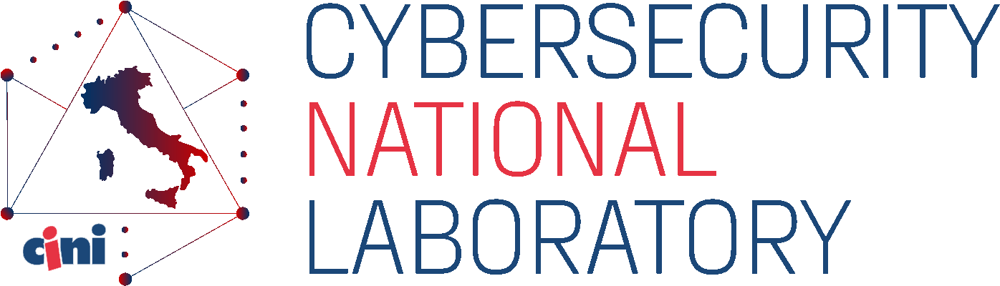

# ICC2022 A/D Services

Attack/Defense services for the International Cybersecurity Challenge 2022 - Athens

organized by the team of the [CINI - Cybersecurity National Laboratory](https://cybersecnatlab.it)

  
  

Event coordinator: [Gaspare Ferraro](https://github.com/GaspareG)

Platform and system administrators: [Giovanni Minotti](https://github.com/Giotino) and [Gaspare Ferraro](https://github.com/GaspareG)

## Services

|  #  | service                         | store | vulns |   port(s)    | categories              | author(s)                                                                               |
| :-: | :------------------------------ | :---: | :---: | :----------: | ----------------------- | --------------------------------------------------------------------------------------- |
|  1  | [ClosedSea](/services/service1) |   2   |   5   |   300{3,4}   | web / crypto            | [@bonaff](https://github.com/RiccardoBonafede) [@drago-96](https://github.com/drago-96) |
|  2  | [CyberUni](/services/service2)  |   3   |   8   | 123{4,5,6,7} | rev / web / crypto      | [@mr-96](https://github.com/mr-96) [@drago-96](https://github.com/drago-96)             |
|  3  | [RPN](/services/service3)       |   2   |   9   |     1337     | pwn / pwn               | [@zxgio](https://github.com/zxgio)                                                      |
|  4  | [Trademark](/services/service4) |   1   |   4   |     5000     | windows / misc / crypto | [@TheNodi](https://github.com/TheNodi) [@mr-96](https://github.com/mr-96)               |

## Checkers & exploits

See [checkers/](/checkers) and [exploits/](/exploits)

## Final scoreboard

## Competition data

- Team info: [team.csv](/data/team.csv)
- Service info: [service.csv](/data/service.csv)
- Flags generated: [flag.csv](/data/flag.csv)
- Stolen flags: [stolen_flags.csv](/data/stolen_flags.csv)
- Team service: [team_service.csv](/data/team_service.csv)
- Checks: [checks.csv](/data/checks.csv)

## Network diagram

