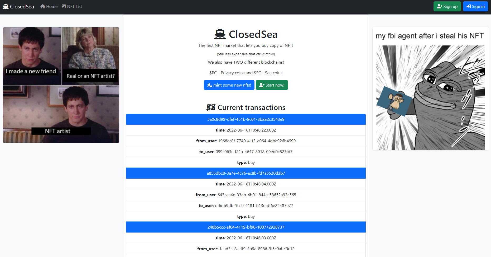

# ClosedSea

| Service 1     | ClosedSea                                                           |
| :------------ | :------------------------------------------------------------------ |
| Author(s)     | @RiccardoBonafede @drago-96                                         |
| Store(s)      | 2                                                                   |
| Category(ies) | web / crypto                                                        |
| Port(s)       | 300{3,4}                                                            |
| FlagId(s)     | NFT Id (store1) / NFT Id (store2)                                   |
| Checker(s)    | [store1](/checkers/0/checker.py) / [store2](/checkers/1/checker.py) |

## Description

ClosedSea is a platform for NFT trading. Flags are stored in the secret data of an NFT, which will only be revealed to the owner.

There are two "chains" in which the NFTs live: a public one, and a private one; there are also two type of coins: $SC (Sea Coins) for the public one, and $PC (Privacy Coins) for the private one.

In the public chain, all users can list and buy available NFTs; in the private chain NFTs are not listed and cannot be bought, but only donated.

Users can also mint their own NFTs, setting the desired price, privacy and secret data.

### Architecture

The web-facing application is ClosedSea, which manages user registration and login, and provides a frontend for viewing and buying NFTs, as well as displaying live transactions.

Most of the logic of doing operations on NFTs (buy, donate, mint, switch chain) is handled in the `transactions` component, which is an Express webserver. It provides APIs for the actions, and directly writes to the database; it is also a WebSocket server for broadcasting live transactions.

Finally, there is a `minter` component written in PHP, which is a frontend for minting new NFTs.

### Cryptography

All transactions (buy and donate) are digitally signed with ECDSA on the secp256k1 curve. In the registration form a user can generate a keypair, store the private key in the browser and send the public key to the server.

Signatures will be made client side while buying on OpenSea, and will be verified on the `transactions` host.

## Vulnerabilities

### Store 1: private NFTs

The service is vulnerable to an [HTTP request smuggling attacks](https://portswigger.net/web-security/request-smuggling), this can be used as a base to exploit several vulnerabilities in the service. 

#### Vuln 1: switch chains

The "switch chain" operation is not signed, so we can smuggle a request for arbitrary NFTs and buy them legally once they are public.

#### Vuln 2: buy private NFTs

The check that private NFTs cannot be bought is only made on OpenSea. So we can smuggle a request to buy a private NFT with our own money.

### Store 2: public NFTs

#### Vuln 1: negative price

The minter allows negative prices for the NFTs; in this way when buying a negative price NFT we can get almost infinite money and legally buy the flag.

#### Vuln 2: key recovery

The JS code that signs a transaction badly generates the ECDSA nonce, thus the private key of an account can be recovered just from a single signature. Once we have the private key of the owner of the NFT, we can use it to sign a donation for that NFT.

#### Vuln 3: arbitrary donation

The `transactions` component doesn't check if the signature has been made with the NFT owner's keys; so it is possible to send a donate transaction with any valid signature from the keypair of a new user.

## Exploits

| service   | store | exploit                                                                                      |
| :-------- | :---: | :------------------------------------------------------------------------------------------- |
| ClosedSea |   1   | [service1-store1-vuln1-h2csmuggling.py](/exploits/service1-store1-vuln1-h2csmuggling.py)     |
| ClosedSea |   1   | [service1-store1-vuln2-switch-by-mint.py](/exploits/service1-store1-vuln2-switch-by-mint.py) |
| ClosedSea |   2   | [service1-store2-vuln1-negativeprice.py](/exploits/service1-store2-vuln1-negativeprice.py)   |
| ClosedSea |   2   | [service1-store2-vuln2-keyrecovery.py](/exploits/service1-store2-vuln2-keyrecovery.py)       |
| ClosedSea |   2   | [service1-store2-vuln3-donateall.py](/exploits/service1-store2-vuln3-donateall.py)           |
