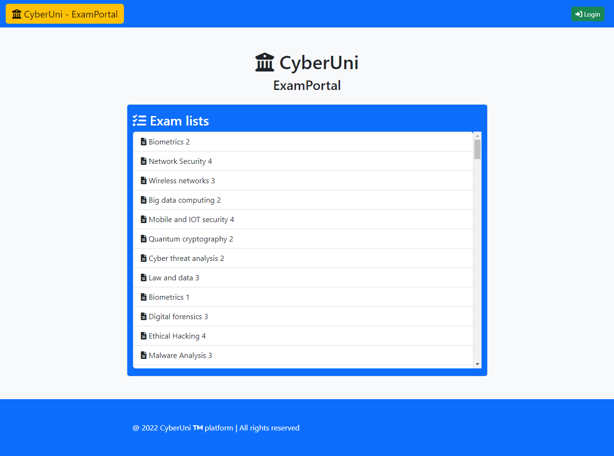

# CyberUni

| Service 2     | CyberUni                                                                                                              |
| :------------ | :-------------------------------------------------------------------------------------------------------------------- |
| Author(s)     | @mr-96 @drago-96                                                                                                      |
| Store(s)      | 3                                                                                                                     |
| Category(ies) | rev-crypto / crypto / web                                                                                             |
| Port(s)       | 123{4,5,6,7}                                                                                                          |
| FlagId(s)     | username (ExamNotes) / username (EncryptedNotes) / exam id (ExamPortal)                                               |
| Checker(s)    | [ExamNotes](/checkers/2/checker.py) / [EncryptedNotes](/checkers/3/checker.py) / [ExamPortal](/checkers/4/checker.py) |

## Description

This service is a simplified Kerberos-like infrastructure: there is a central authentication service that distribute tokens to login on 3 different apps. Every app is a flagstore.

### Auth service

The Auth service is the core of the "user management" part of the service: it manages registration (with users stored in txt files) and authentication (with a python library written in c++ that emulates the key distribution center of a Kerberos infrastructure). From this app an user can receive tokens to login on the 3 subservices. This app has no flags, but it can be used to trick the authentication verification in the "ExamNotes" app to get one flagstore.

### App 1 - ExamNotes

This service is a simple plaintext-notes app. Users can login via token, write, read and list their notes. Flags are in the notes of the admin (the username associated to the flag_id).

### App 2 - EncryptedNotes

This service runs two-party computation between the server and the client, using the construction based on garbled circuits (with "Free XOR" optimization) and oblivious transfer.

After selecting the function to evaluate (either `f(s, c) = c` or `f(s, c) = AES_s(c)`), the server returns a garbled circuit for the given function, and then runs the interactive OT with the client to give it the corresponding labels. The client will then evaluate the circuit and read the output bits.

In both cases the server's input will be an AES key that it uses to encrypt the flag.

### App 3 - ExamPortal

This simple webapp allows users (the "profs") to create exams and other users (the "students") to answer them. The service automatically grades the given answers, and if all of them are correct it gives the flag away.

## Vulnerabilities

### Auth service

#### Vuln 1: invalid curves

The functions "Add" and "Multiply" of the ellipticcurve class of CryptoPP do not sanitize the given parameters: one malicious client can corrupt the key-exchange part of the protocol giving the identity point on the elliptic curve and login with every user without knowing the password. This vulnerability allows player to login on ExamNotes and read the plaintext notes of the admin. This is not useful in the other 2 services, since logging in as the admin does not give the plaintext flag.

### ExamNotes

#### Vuln 1: hardcoded key

The service key is hardcoded: players can reverse engineer the protocol and craft tokens for every user, including the admins.

#### Vuln 2: path traversal

There is a path traversal in the read_note function, letting users read notes of other users by simply creating an empty note and then ask for `../sha256 of flag_id/0`

#### Vuln 3: tag not checked

Inside tokens there is an `HMAC` that is never checked by this app: this allows attackers to tamper with the tokens and login as other users.

### EncryptedNotes

#### Vuln 1: ungarbled circuits

When garbling the computation circuit the server transforms each gate (excluding XOR) into a table encoding the operation; however, it doesn't randomize the table.

This leads to the recovery of the server's secret input, in particular using the "echo" function: using any client input (for example all zeros) and decoding the i-th gate, if we get the value of the output wire from the first two elements the server's bit is 0, otherwise it's a 1.

#### Vuln 2: output wires are not obfuscated

When sending the circuit, the server sends the `wires` values of the output bits instead of an obfuscated/hased version. This leads the client to compute the free XOR parameter `R`, and thus obtaining the input labels corrseponding to both 0 and 1 for each of the client's bits.

We can use this to evaluate the circuit with arbitrary inputs. By carefully analyzing the paths of the wires (in particular those leading to an AND gate) we can write linear equations with the server's private bits as unknowns; collecting enough of these equations to get high enough rank makes the recovery of the server's key possible.

#### Vuln 3: OT uses fixed randomness

The [chosen OT protocol](https://en.wikipedia.org/wiki/Oblivious_transfer#1%E2%80%932_oblivious_transfer) uses a fixed pair of `x0, x1` for all the bits, again making it possible to recover both the labels.

In particular, when sending as `v` a vector composed by all `x0` we get `c0 = m0` and `c1 = m1 + k`, with a fixed `k` for all bits. Since we know that `m1 = m0 ^ R`, we can check if some `R` is the solution by checking if all the `c1 - (c0 ^ R)` are constant; doing this bit by bit reveals `R` in short time.

At this point, we repeat the attack at step 2 of analyzing the circuit with the possibility of evaluating on arbitrary inputs.

### ExamPortal

#### Vuln 1: type juggling with JSON

The `submit` endpoint reads a JSON as input; it then checks the answers with `$corr_ans == $obj["answers"][$i]`.

Given that the correct answer is a string ("A", "B", "C" or "D"), we can make send the value 0 (as an integer), and then PHP will evaluate `"A" == 0` to true, and we will gett full points.

#### Vuln 2: bool assigment with "and"

There is an endpoint to view the answers to an exam, but should be accessible only by the exam creator.

However, the access control is made via `$can_view = $user->has2fa() and $exam->getOwner() === $user->getId();`. In PHP the operator `and` loses precedence to the assignment `=`; so if a user sets up an account with the 2fa enabled, this line will be evaluated as `($can_read = true) and false`, giving access to the answers to all users with 2fa enabled.

## Exploits

| service                   | store | exploit                                                                                        |
| :------------------------ | :---: | :--------------------------------------------------------------------------------------------- |
| CyberUni - ExamNotes      |   1   | [service2-store1-vuln1-hardcoded-key.py](/exploits/service2-store1-vuln1-hardcoded-key.py)     |
| CyberUni - ExamNotes      |   1   | [service2-store1-vuln2-path-traversal.py](/exploits/service2-store1-vuln2-path-traversal.py)   |
| CyberUni - ExamNotes      |   1   | [service2-store1-vuln3-tag-not-checked.py](/exploits/service2-store1-vuln3-tag-not-checked.py) |
| CyberUni - ExamNotes      |   1   | [service2-store1-vuln4-auth-bypass.py](/exploits/service2-store1-vuln4-auth-bypass.py)         |
| CyberUni - EncryptedNotes |   2   | [service2-store2-vuln1-ungarbled.py](/exploits/service2-store2-vuln1-ungarbled.py)             |
| CyberUni - EncryptedNotes |   2   | [service2-store2-vuln2-wiresout.sage](/exploits/service2-store2-vuln2-wiresout.sage)           |
| CyberUni - EncryptedNotes |   2   | [service2-store2-vuln3-otrandom.sage](/exploits/service2-store2-vuln3-otrandom.sage)           |
| CyberUni - ExamPortal     |   3   | [service2-store3-vuln1-zeros.py](/exploits/service2-store3-vuln1-zeros.py)                     |
| CyberUni - ExamPortal     |   3   | [service2-store3-vuln2-viewexam.py](/exploits/service2-store3-vuln2-viewexam.py)               |

## Build

Dependencies:

- Crypto++ (https://cryptopp.svn.sourceforge.net/svnroot/cryptopp/trunk/c5)
- Rapidjson (https://rapidjson.org/)

Build Crypto++ with the provided Makefile, being sure that you compile with -fPIC (true by default for most OS in the Makefile, tested on Ubuntu 20.04). Note: the version distributed via apt is not compiled with -fPIC.

Build the Python library with `g++ -Wall -shared -std=c++11 -fPIC $(python3 -m pybind11 --includes) authlib.cpp -o authlib$(python3-config --extension-suffix) -L. -l:libcryptopp.a`
