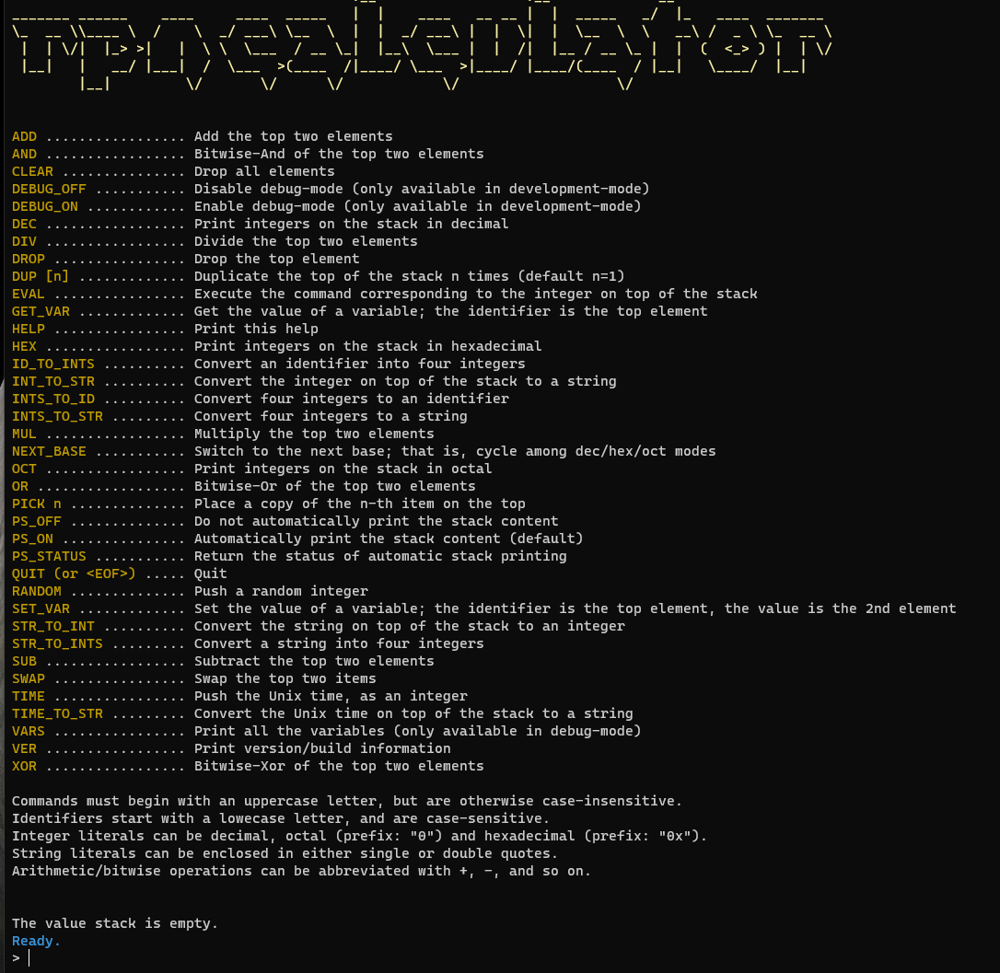

# RPN Calculator

| Service 3     | RPN Calculator                                                      |
| :------------ | :------------------------------------------------------------------ |
| Author(s)     | @zxgio                                                              |
| Store(s)      | 2                                                                   |
| Category(ies) | pwn                                                                 |
| Port(s)       | 1337                                                                |
| FlagId(s)     | None                                                                |
| Checker(s)    | [store1](/checkers/5/checker.py) / [store2](/checkers/6/checker.py) |

## Description

This service is a reverse-polish notation calculator that allows users to permanently store a limited number of string/integer variables.
Variables are saved into the regular file `flag-store`, and older variables are replaced by new ones.

Flags are stored as string variables, with random-appearing names (the names are deterministic, but unknown to players).

Inside the process, those variables are split in two different "stores", that is memory areas.
This means that exploiting a vulnerability may give you (in)direct access to some flags, but not necessarily all of them.

To prevent a team from overwriting the variables set by other teams or by the checker, a maximum number of variables is reserved for each team within each store.
To enforce this rule, without requiring a login process, when a user requests to set/update a variable, the service issues a cryptographic challenge which must be signed with their secret key using EdDSA (Curve25519 and BLAKE2b).
An example script, which can be used interactively, is provided in `sign_challenge.py`.

The script `gen_keys.py` generates:

- a set of 8 new signing (`sk0`...`sk7`) and verifying (`vk0`...`vk7`) keys
- a Python source `s_keys.py`, with signing keys, to be used in the checker
- a C source `v_keys.c`, with verifying keys, to be used in the service source `rpn.c`

The program is configured to work with up to 8 signing entities: the checker + up to 7 teams. The checker must use key number 0, otherwise some exploits may fail. Each entity can use up to 8 (`MAX_VAR_IN_STORE_PER_SIGNER` in `rpn.c`) slots in each variable store, whose size is 64 (`N_VARS_PER_STORE` in `rpn.c`). To accommodate more teams, you need to adjust these constants; e.g., you can have up to 15 teams by setting `MAX_VAR_IN_STORE_PER_SIGNER` to 4.

## Vulnerabilities

### Debug-mode

A low-hanging fruit to get all the flags at once is using the command `VARS`.
However, this command can only be used in debug-mode, which is disabled.
Moreover, it cannot be enabled, since environment variable `DEVELOPMENT_MODE` is not defined in the running environment.

However, there are a couple of bugs that allow an attacker to enable debug-mode:

1. The current numerical-base (dec/hex/oct), encoded as 2-bits, and the debug flag are stored inside the same integer. The command `NEXT_BASE`, which switches numerical bases, is implemented using a wrong bitmask and a repeated use of such a command enables debug-mode
2. In string-literal parsing, double-backslash escape sequences are wrongly handled, allowing an attacker to overwrite/enable debug-mode by underflowing a buffer

### Leaks

1. By crafting a malformed octal integer of maximal length an attacker can leak all names of variables in store1 via the error message
2. The command `PICK` does not correctly check negative indexes, allowing to leak values from store1
3. The command `SWAP` has an undocumented parameter, that can be found by reversing the program, that allows an attacker to read (but not write, since the command does not really "swap" in those cases) from store1
4. Pushing identifiers on a full stack allows to freely increase its size, without actually growing the stack. So, an attacker can leverage the command `PICK`, with large indexes, to read from store2
5. Because of a wrong format string (`"%sd"` instead of `"%jd"`) the error message used when a Unix-time is out of range, in command `TIME_TO_STR`, leaks the content of store2 as a string

### Arbitrary read-primitives

There are two arbitrary read-primitives, hidden as undocumented commands. One, `PEEK`, should be clearly visible when reversing the tokenize routine.
To discover the other one, `[todo]HxD`, a reverser must first reconstruct how command names are hashed (to be used as index in a binary tree), and then recover all names.

These two potential vulnerabilities must be combined with a leak, in order to defeat ASLR.
And there are, indeed, two leaks:

1. The integer literal `0x0ddba11` is shown as its address when printing the stack (this can be classified more as a "backdoor" than a bug)
2. Because the random-generator is initialized too late, if the very first command is `RANDOM`, then its result is a data-address XORed with a known constant. On the other hand, all subsequent results of `RANDOM` are the same data address XORed with a truly random number, making the result truly random as well.

## Exploits

| service | store | exploit                                                          |
| :------ | :---: | :--------------------------------------------------------------- |
| RPN     |  1+2  | [service3-deaslr1-read1.py](/exploits/service3-deaslr1-read1.py) |
| RPN     |  1+2  | [service3-deaslr1-read2.py](/exploits/service3-deaslr1-read2.py) |
| RPN     |  1+2  | [service3-deaslr2-read1.py](/exploits/service3-deaslr2-read1.py) |
| RPN     |  1+2  | [service3-deaslr2-read2.py](/exploits/service3-deaslr2-read2.py) |
| RPN     |  1+2  | [service3-debug-mode-1.py](/exploits/service3-debug-mode-1.py)   |
| RPN     |  1+2  | [service3-debug-mode-2.py](/exploits/service3-debug-mode-2.py)   |
| RPN     |   1   | [service3-leak-1.py](/exploits/service3-leak-1.py)               |
| RPN     |   1   | [service3-leak-2.py](/exploits/service3-leak-2.py)               |
| RPN     |   1   | [service3-leak-3.py](/exploits/service3-leak-3.py)               |
| RPN     |   2   | [service3-leak-4.py](/exploits/service3-leak-4.py)               |
| RPN     |   2   | [service3-leak-5.py](/exploits/service3-leak-5.py)               |

## Patches

The 9 different patches are available in [src/patch_binary.py](src/patch_binary.py) script.
