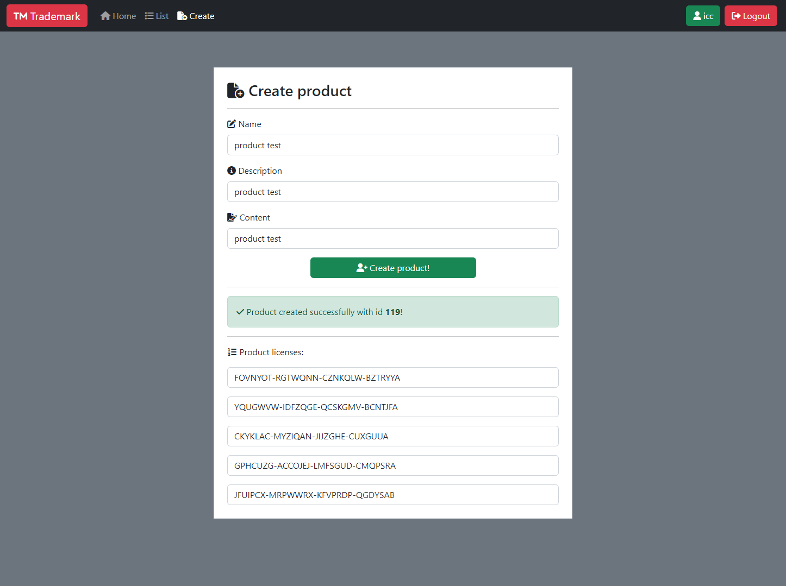

# Trademark

| Service 4     | Trademark                        |
| :------------ | :------------------------------- |
| Author(s)     | @TheNodi @mr-96                  |
| Store(s)      | 1                                |
| Category(ies) | windows / misc / crypto          |
| Port(s)       | 5000                             |
| FlagId(s)     | Product Id                       |
| Checker(s)    | [store1](/checkers/7/checker.py) |

## Description

Trademark is a .NET License Server.

Users can create products with a secret content and generate a number of license keys.
Keys can be used to download the content of the products.
Flags are stored as "private" product content in a SQLite file.

## Vulnerabilities

### Auth Bypass

Auth Middleware is checking for `/api/login` or `/api/register` to skip user verification.
Strings are matched against the entirety of the request path and query, not just query.
Unauthenticated users can download license files directly.

### License generation

The license keys are zeros of a (public) polynomial. There are a few problems in the licenses generation:
- Since the polynomial generation starts from [0,1], 0 is always a root, and so the licence representing 0 (that is `AAAAAAA-AAAAAAA-AAAAAAA-AAAAAAA`) always passes, even if it's not listed.
- The polynomial is taken modulo a prime number, so it is easy to find all the roots just knowing the coefficients, and so recover all the licenses.
- The roots representing the licenses are a lot smaller than the modulus (and also the degree of the polynomial is low), letting small roots recovery via LLL feasible.

## Exploits

| service   | store | exploit                                                                                    |
| :-------- | :---: | :----------------------------------------------------------------------------------------- |
| Trademark |   1   | [service4-store1-vuln1-auth-bypass.py](/exploits/service4-store1-vuln1-auth-bypass.py)     |
| Trademark |   1   | [service4-store1-vuln2-roots.sage](/exploits/service4-store1-vuln2-roots.sage)             |
| Trademark |   1   | [service4-store1-vuln3-small-roots.sage](/exploits/service4-store1-vuln3-small-roots.sage) |
| Trademark |   1   | [service4-store1-vuln4-zero-poly.py](/exploits/service4-store1-vuln4-zero-poly.py)         |
